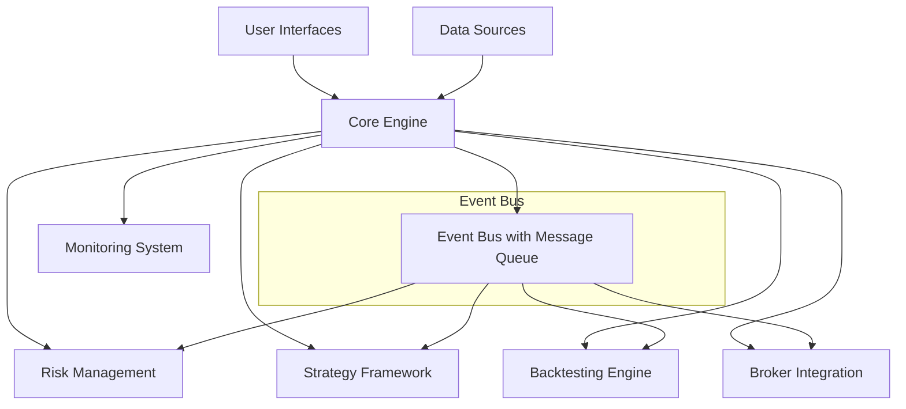

# Design Document: Quantitative Trading System

## Overview

The quantitative trading system is designed as a lightweight, event-driven platform that unifies backtesting and live trading through a shared architecture. The system prioritizes performance, reliability, and ease of use while maintaining the flexibility to support various trading strategies and broker integrations.

### Key Design Principles

- **Event-Driven Architecture**: All system components communicate through events, ensuring loose coupling and high scalability
- **Unified Codebase**: Strategies run identically in backtesting and live trading modes
- **Modular Design**: Components can be independently developed, tested, and replaced
- **Performance First**: Sub-100ms event processing with >1000x backtesting speed
- **Reliability**: >99.5% uptime with graceful degradation and automatic recovery

## Architecture

### High-Level Architecture



### Event-Driven Core Design

The system centers around an event bus that handles all inter-component communication:

- **Event Types**: MarketDataEvent, OrderEvent, PositionEvent, RiskEvent, SystemEvent
- **Event Processing**: Asynchronous processing with guaranteed ordering per symbol
- **Event Persistence**: Event sourcing for replay and recovery capabilities
- **Backpressure Control**: Queue management to prevent memory overflow

**Design Rationale**: Event-driven architecture ensures loose coupling between components, enables easy testing, and provides natural scalability. Event sourcing allows for precise backtesting replay and system recovery.

## Components and Interfaces

### 1. Core Engine

**Purpose**: Central orchestrator managing the event bus and component lifecycle.

```python
class CoreEngine:
    def __init__(self):
        self.event_bus = EventBus()
        self.components = {}
        self.state = SystemState()
    
    async def start(self) -> None
    async def stop(self) -> None
    async def process_event(self, event: Event) -> None
    def register_component(self, component: Component) -> None
```

**Key Features**:
- Event bus management with at-least-once delivery
- Component lifecycle management
- System state persistence and recovery
- Performance monitoring and metrics collection

### 2. Data Management Layer

**Purpose**: Unified interface for multiple data sources with caching and failover.

```python
class DataManager:
    def __init__(self):
        self.sources = {}
        self.cache = DataCache()
        self.validator = DataValidator()
    
    async def get_market_data(self, symbol: str, timeframe: str) -> MarketData
    async def get_historical_data(self, symbol: str, start: datetime, end: datetime) -> List[MarketData]
    def subscribe_real_time(self, symbol: str, callback: Callable) -> None
```

**Data Sources Supported**:
- REST APIs (Alpha Vantage, Yahoo Finance, etc.)
- WebSocket feeds for real-time data
- Local CSV/Parquet files
- Database connections

**Caching Strategy**: 
- L1 Cache: In-memory LRU cache for frequently accessed data
- L2 Cache: Persistent storage for historical data
- Cache invalidation based on data age and market hours

**Design Rationale**: Abstraction layer allows easy addition of new data sources. Caching reduces API costs and improves performance. Data validation ensures strategy reliability.

### 3. Strategy Framework

**Purpose**: Standardized framework for strategy development with guaranteed compatibility between backtesting and live trading.

```python
class AbstractStrategy:
    def __init__(self, name: str, parameters: Dict):
        self.name = name
        self.parameters = parameters
        self.portfolio = Portfolio()
    
    async def on_market_data(self, data: MarketData) -> None
    async def on_order_update(self, order: Order) -> None
    async def on_position_update(self, position: Position) -> None
    def generate_signals(self) -> List[Signal]
```

**Strategy Lifecycle**:
1. Initialization with parameters
2. Event subscription registration
3. Real-time event processing
4. Signal generation and order placement
5. Performance tracking and reporting

**Hot-Reloading**: Strategies can be updated without system restart using Python's importlib and careful state management.

**Design Rationale**: Abstract base class ensures consistent interface. Event-driven design allows strategies to react to market changes immediately. Hot-reloading enables rapid strategy development.

### 4. Backtesting Engine

**Purpose**: High-speed historical simulation with accurate market modeling.

```python
class BacktestEngine:
    def __init__(self):
        self.simulator = MarketSimulator()
        self.performance_analyzer = PerformanceAnalyzer()
        self.report_generator = ReportGenerator()
    
    async def run_backtest(self, strategy: Strategy, start_date: datetime, end_date: datetime) -> BacktestResult
    def calculate_metrics(self, trades: List[Trade]) -> PerformanceMetrics
    def generate_report(self, result: BacktestResult) -> Report
```

**Market Simulation Features**:
- Realistic order execution with slippage modeling
- Transaction cost calculation
- Market impact simulation for large orders
- Multiple timeframe support
- Survivorship bias handling

**Performance Optimization**:
- Vectorized calculations using NumPy/Pandas
- Parallel processing for parameter optimization
- Memory-efficient data streaming for large datasets

**Design Rationale**: Separate simulation engine allows for sophisticated market modeling. Vectorized operations achieve >1000x speed requirement. Identical strategy interface ensures backtesting accuracy.

### 5. Broker Integration Layer

**Purpose**: Unified interface for multiple brokers with automatic failover and rate limiting.

```python
class BrokerInterface:
    async def place_order(self, order: Order) -> OrderResponse
    async def cancel_order(self, order_id: str) -> CancelResponse
    async def get_positions(self) -> List[Position]
    async def get_account_info(self) -> AccountInfo
    
class BrokerManager:
    def __init__(self):
        self.brokers = {}
        self.rate_limiter = RateLimiter()
        self.connection_monitor = ConnectionMonitor()
```

**Supported Brokers**:
- Interactive Brokers (via IB API)
- Alpaca Markets
- Paper trading simulator
- Extensible plugin architecture for additional brokers

**Rate Limiting**: Token bucket algorithm with broker-specific limits to prevent API violations.

**Design Rationale**: Adapter pattern allows easy broker addition. Rate limiting prevents API violations. Connection monitoring ensures reliable order execution.

### 6. Risk Management System

**Purpose**: Real-time risk monitoring and automatic position protection.

```python
class RiskManager:
    def __init__(self):
        self.rules = []
        self.monitors = {}
        self.emergency_stop = EmergencyStop()
    
    async def evaluate_order(self, order: Order) -> RiskDecision
    async def monitor_positions(self) -> None
    async def calculate_risk_metrics(self) -> RiskMetrics
    def add_risk_rule(self, rule: RiskRule) -> None
```

**Risk Rules**:
- Position size limits per symbol and total portfolio
- Maximum drawdown thresholds
- Sector concentration limits
- Volatility-based position sizing
- Stop-loss and take-profit automation

**Real-time Monitoring**: 
- Continuous portfolio risk calculation
- Alert generation for threshold breaches
- Automatic position reduction or closure

**Design Rationale**: Rule-based system allows flexible risk management. Real-time monitoring prevents large losses. Emergency stop provides ultimate protection.

## Data Models

### Core Data Structures

```python
@dataclass
class MarketData:
    symbol: str
    timestamp: datetime
    open: float
    high: float
    low: float
    close: float
    volume: int
    timeframe: str

@dataclass
class Order:
    id: str
    symbol: str
    side: OrderSide  # BUY/SELL
    type: OrderType  # MARKET/LIMIT/STOP
    quantity: int
    price: Optional[float]
    status: OrderStatus
    timestamp: datetime

@dataclass
class Position:
    symbol: str
    quantity: int
    average_price: float
    market_value: float
    unrealized_pnl: float
    realized_pnl: float

@dataclass
class Portfolio:
    cash: float
    positions: Dict[str, Position]
    total_value: float
    daily_pnl: float
```

### Event Models

```python
@dataclass
class Event:
    id: str
    timestamp: datetime
    type: EventType
    source: str
    data: Dict[str, Any]

class EventType(Enum):
    MARKET_DATA = "market_data"
    ORDER_UPDATE = "order_update"
    POSITION_UPDATE = "position_update"
    RISK_ALERT = "risk_alert"
    SYSTEM_STATUS = "system_status"
```

**Design Rationale**: Dataclasses provide type safety and serialization. Immutable events ensure data consistency. Clear separation between market data and system events.

## Error Handling

### Error Categories and Strategies

1. **Transient Errors** (Network timeouts, API rate limits)
   - Exponential backoff retry with jitter
   - Circuit breaker pattern for failing services
   - Graceful degradation to cached data

2. **Data Errors** (Invalid prices, missing data)
   - Data validation and sanitization
   - Fallback to alternative data sources
   - Strategy notification of data quality issues

3. **System Errors** (Memory exhaustion, disk full)
   - Resource monitoring and alerting
   - Automatic cleanup of old data
   - Emergency shutdown procedures

4. **Strategy Errors** (Logic errors, exceptions)
   - Strategy isolation using separate processes
   - Error logging and notification
   - Automatic strategy restart with backoff

### Recovery Mechanisms

- **Event Replay**: Reconstruct system state from event log
- **Checkpoint Recovery**: Restore from last known good state
- **Graceful Degradation**: Continue operation with reduced functionality
- **Manual Override**: Emergency controls for critical situations

**Design Rationale**: Comprehensive error handling ensures system reliability. Different strategies for different error types optimize recovery time. Event sourcing enables precise state reconstruction.

## Testing Strategy

### Testing Pyramid

1. **Unit Tests** (70% coverage target)
   - Individual component testing
   - Mock external dependencies
   - Property-based testing for mathematical functions

2. **Integration Tests** (20% coverage target)
   - Component interaction testing
   - Database and broker API integration
   - End-to-end event flow validation

3. **System Tests** (10% coverage target)
   - Full system backtesting scenarios
   - Performance and load testing
   - Chaos engineering for fault tolerance

### Continuous Testing

- **Pre-commit Hooks**: Code quality and basic tests
- **CI/CD Pipeline**: Full test suite on every commit
- **Nightly Tests**: Extended backtesting and performance tests
- **Production Monitoring**: Real-time system health checks

### Test Data Management

- **Synthetic Data**: Generated market data for unit tests
- **Historical Data**: Real market data for integration tests
- **Anonymized Production Data**: Sanitized live trading data for system tests

**Design Rationale**: Comprehensive testing strategy ensures system reliability. Different test types catch different classes of bugs. Continuous testing prevents regressions.

## Performance Considerations

### Latency Optimization

- **Event Processing**: <100ms target through async processing and efficient data structures
- **Memory Management**: Object pooling and careful garbage collection tuning
- **Network Optimization**: Connection pooling and request batching
- **Database Access**: Query optimization and connection pooling

### Scalability Design

- **Horizontal Scaling**: Event bus can be distributed across multiple nodes
- **Vertical Scaling**: Multi-threading for CPU-intensive operations
- **Resource Management**: Dynamic resource allocation based on load
- **Caching Strategy**: Multi-level caching to reduce external API calls

### Monitoring and Profiling

- **Performance Metrics**: Latency, throughput, and resource utilization
- **Application Profiling**: CPU and memory usage analysis
- **Business Metrics**: Trading performance and system reliability
- **Alerting**: Automated alerts for performance degradation

**Design Rationale**: Performance requirements drive architectural decisions. Monitoring ensures performance targets are met. Scalability design supports future growth.